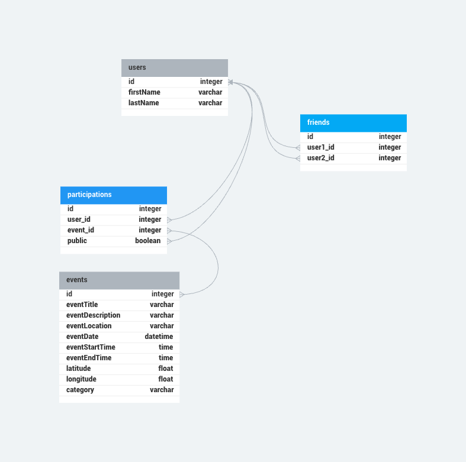

# JoinMe 

This is an MVP MERN stack project, a part of CodeOp's Full Stack Development Training.<br>
Utilizes CRUD operations and graph database modeling.

## What is it for?

Built for organizing, visualizing, and joining friend's events and activities.<br>
Includes a map for automatic user localization and visibility of nearby events, along with a synchronized calendar for event saving.


## Table of contents

- [Setup](#setup)
  - [Database prep](#database-prep)
  - [Dependencies](#dependencies)
  - [Development](#development)
- [Resources](#resources)

## Setup

### Dependencies

- Run `npm install` in project directory. This will install server-related dependencies such as `express`.
- `cd client` and run `npm install`. This will install client dependencies (React).


### Database Prep
- Access the MySQL interface in your terminal by running `mysql -u root -p`
- Create a new database called mvpData: `create database mvpData`
- Add a `.env` file to the project folder of this repository containing the MySQL authentication information for MySQL user. For example:

```bash
  DB_HOST=localhost
  DB_USER=root
  DB_NAME=mvpData
  DB_PASS=YOURPASSWORD
```

- Run `npm run migrate` in the project folder of this repository, in a new terminal window. This will create a table called 'students' in your database.

- Make sure you understand how the `users`, `events`, `friends` and `participations` table are constructed.
- If needed make test on postman to understand them better :).
-  In your MySQL console, you can run `use mvpData;` and then `describe events;` to see the structure of the events table, you can do it with all the tables.





### Development
- Before Dvelopment you must generate your own API  keys for the followings: Google geolocation & Thunderforest map API.
- Create an .env file inside /client and paste them like this, replacing 'YOURKEY' with corresponding personal APIs key generated:

```bash
VITE_GOOGLE_MAPS_API_KEY=YOURKEY
VITE_APP_THUNDERFOREST_API_KEY=YOURKEY
````
- Don't forget to also add to .gitignore .env.

#### We are almost there!
- Run `npm start` in project directory to start the Express server on port 4000
- In another terminal, do `cd client` and run `npm run dev` to start the client in development mode with hot reloading in port 5173.
( I use React BigCalendar for the calendar template, it might give some error message regarding its .css file, ignore it. )

## Resources 

### Calendar
https://github.com/jquense/react-big-calendar

### maps
https://www.leafletjs.com/)
https://www.tutorialspoint.com/leafletjs/leafletjs_markers.htm
https://www.thunderforest.com/

### Graph database
https://learn.microsoft.com/en-us/sql/relational-databases/graphs/sql-graph-architecture?view=sql-server-ver16
https://neo4j.com/developer/graph-database/
